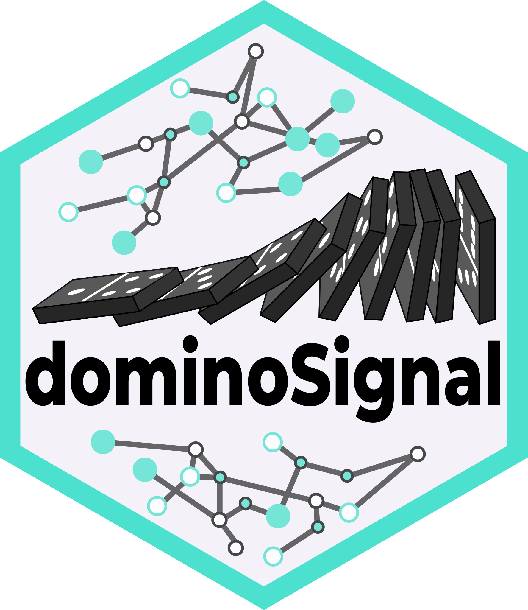

# Introducing dominoSignal: Improved Inference of Cell Signaling from Single Cell RNA Sequencing Data <a href="https://fertiglab.github.io/dominoSignal/"></a>

dominoSignal infers intra- and intercellular signaling from single cell RNA sequencing (scRNAseq) data. Within each cell cluster, it identifies transcription factors (TFs) with enriched activity and links them to receptors whose expression correlates with that activity. It then connects those active receptors to ligands expressed by other clusters, producing a cluster-to-cluster signaling network associated with downstream transcriptional response rather than ligand and receptor expression alone.

dominoSignal builds on the original [domino](https://github.com/Elisseeff-Lab/domino) R package ([Cherry et al., 2021, *Nature Biomedical Engineering*](https://doi.org/10.1038/s41551-021-00770-5)) and adds the Differential Cell Signaling Test (DCST) for statistically comparing signaling across subjects and conditions ([Mitchell et al., 2026, *Bioinformatics*](https://doi.org/10.1093/bioinformatics/btag089)).

## Installation

dominoSignal is available from [Bioconductor](https://bioconductor.org/packages/release/bioc/html/dominoSignal.html):


``` r
if (!requireNamespace("BiocManager", quietly = TRUE)) {
    install.packages("BiocManager")
}
BiocManager::install("dominoSignal")
```

The development version, with the latest features and fixes, is available from Bioconductor devel:


``` r
BiocManager::install(version = "devel")
BiocManager::install("dominoSignal")
```

Changes between versions, including any that affect results, are listed in the [changelog](https://fertiglab.github.io/dominoSignal/news/index.html).

## Usage Overview

Here is an overview of how dominoSignal might be used in analysis of a single cell RNA sequencing data set:

1. **Prepare inputs**: Transcription factor activation scores are calculated (we recommend using [pySCENIC](https://pyscenic.readthedocs.io/en/latest/), but other methods can be used as well). A ligand-receptor database is used to map linkages between ligands and receptors (we recommend using [CellPhoneDB](https://www.cellphonedb.org/), but other methods can be used as well). Counts data, z-scored (scaled) expression, and a named factor of cluster labels are the other required inputs.
2. **Build a signaling network**: The `create_domino()` function stores inputs, tests TF enrichment, and calculates receptor correlation with TF activity. The `build_domino()` function is then used to select thresholds to infer the signaling network.
3. **Explore and visualize results**: Accessor functions are provided to retrieve the contents of the object. To get the inferred network in data frame format, the `dom_to_df()` function is used. There are multiple plotting functions (heatmaps, networks, chord diagrams) to visualize different aspects of the network.
4. **Compare signaling across subjects**: In cases where multiple groups are being compared, the differential signaling workflow identifies linkages that differ between groups.

Please see [our website](https://fertiglab.github.io/dominoSignal/) for tutorials on all of these steps, from downloading and running [pySCENIC](https://pyscenic.readthedocs.io/en/latest/) in the [SCENIC tutorial](https://fertiglab.github.io/dominoSignal/articles/tf_scenic_vignette.html) to building and visualizing domino results on the [Getting Started page](https://fertiglab.github.io/dominoSignal/articles/dominoSignal.html). Other articles include [further details on plotting functions](https://fertiglab.github.io/dominoSignal/articles/plotting_vignette.html), [more information on the structure of the domino object](https://fertiglab.github.io/dominoSignal/articles/domino_object_vignette.html), and [a walkthrough of the differential signaling workflow](https://fertiglab.github.io/dominoSignal/articles/differential_signaling.html).

## Citation

If you use dominoSignal, please cite:

> Cherry C, Maestas DR, Han J, Andorko JI, Cahan P, Fertig EJ, Garmire LX, Elisseeff JH. Computational reconstruction of the signalling networks surrounding implanted biomaterials from single-cell transcriptomics. *Nat Biomed Eng*. 2021;5(10):1228-1238. [doi:10.1038/s41551-021-00770-5](https://doi.org/10.1038/s41551-021-00770-5)

If you use the differential signaling workflow, please also cite:

> Mitchell JT, Stapleton O, Krishnan K, Nagaraj S, Lvovs D, Cherry C, Poissonnier A, Horton W, Adey A, Rao V, Huff A, Zimmerman JW, Kagohara LT, Zaidi N, Coussens LM, Jaffee EM, Elisseeff JH, Fertig EJ. Differential cell signaling testing for cell-cell communication inference from single-cell data by dominoSignal. *Bioinformatics*. 2026;42(3):btag089. [doi:10.1093/bioinformatics/btag089](https://doi.org/10.1093/bioinformatics/btag089)

## Getting help

If you find a bug or have a question, please [open an issue](https://github.com/FertigLab/dominoSignal/issues).
